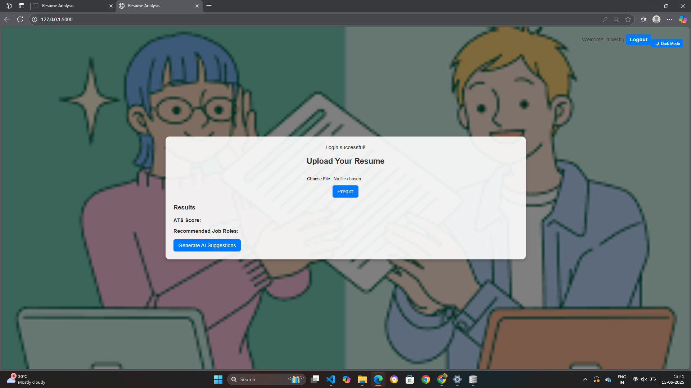
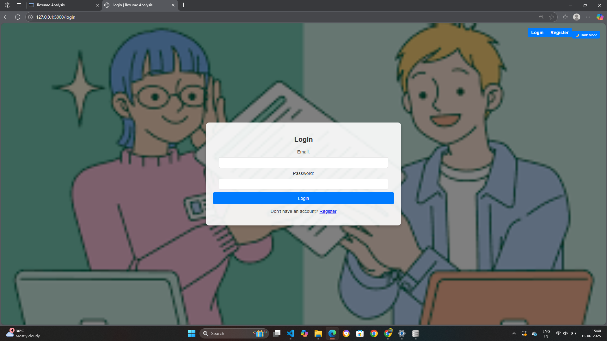

# ATS Resume Analyzer 🔍📄

A smart Resume Analysis web app that predicts ATS scores, suggests job roles , and offers   AI-powered resume improvement suggestions   — built using   Flask + ML + NLP + Google Gemini  .

---

## 🚀 Features

- ✅ ATS Score Prediction 
- ✅ Job Role Prediction from Resume Text
- ✅ AI-Powered Resume Suggestions (via Gemini 2.0-Flash)
- ✅ PDF Resume Parsing (Name, Email, Skills)
- ✅ Secure Login System
- ✅ HR Dashboard: Filter, Sort, View & Download Resumes
- ✅ Responsive Web Design (HTML, CSS, Bootstrap)

---

## 🛠️ Tech Stack

-   Frontend  : HTML, CSS, JavaScript 
-   Backend  : Python (Flask)
-   Machine Learning  : RandomForest, Logistic Regression
-   NLP  : NLTK
-   PDF Parsing  : pdfplumber
-   AI Suggestions  : Google Gemini API
-   Authentication  : Flask-Login

---

## 📁 Project Structure

Advanced-ATS/

├── app.py # Main Flask application

├── utils.py # Resume preprocessing, NLP helpers

├── model.py # ML model training code

├── extract_keywords.py # Keyword & PDF parser

├── templates/ # HTML templates

├── static/ # CSS/JS/images

├── models/ # Saved .joblib models

├── uploads/ # Uploaded PDFs (runtime only)

├── refined_data.csv # Final dataset used for training

├── requirements.txt # Python dependencies

└── README.md # Project description

---

## 💻 How to Run Locally

git clone https://github.com/rawooldipesh/ATS-RESUME-ANALYZER.git
cd ATS-RESUME-ANALYZER

# Create virtual env (optional but recommended)
python -m venv venv
venv\Scripts\activate        # On Windows
source venv/bin/activate     # On macOS/Linux

pip install -r requirements.txt
python app.py
Open browser → http://localhost:5000

🌐 Live Demo (Coming Soon)
🔗 https://ats-resume-analyzer-btmx.onrender.com (check on Computer/Laptop only -not mobile friendly)

### ⚠️ Note on Deployment

This project is currently deployed on **Render.com**, a free hosting platform that may experience occasional cold starts or slower response times due to inactivity or high server load. 

**If you encounter errors like "Internal Server Error" or slow predictions:**

- Please **wait 15–30 seconds** and try again.
- Refresh the page and re-upload your resume.
- Ensure the resume is in **PDF format with readable text** (not scanned image PDFs).

For better performance in the future, we may explore hosting on **Streamlit Cloud** or **Hugging Face Spaces**.
If the app doesn’t respond immediately, please wait a few moments and try again — the server may be waking up from idle or handling another request. For the best experience, consider deploying the app on Hugging Face Spaces or a more scalable platform.

## 📷 Screenshots

### 🏠 Home Page

### 🔐 Login Page

### 📄 Resume Prediction

### 💡 AI Suggestions

🧠 AI Suggestions Powered By
Integrated with Gemini-2.0-Flash (Google Generative AI) to provide personalized resume improvement tips to help job seekers get noticed.

📌 Future Enhancements
📊 Analytics Dashboard for HRs
🔁 Feedback system for improving suggestions

📜 License
MIT License

🤝 Connect With Me
📧 rawooldipesh0@gmail.com
🔗 https://www.linkedin.com/in/dipesh-rawool

